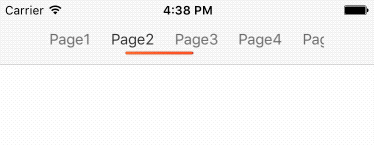

TLSegmentedControl
==================

# Introduce
* 类似于微博的SegmentedControl。

# System Requirement
* iOS 8.0 or later
* Xcode 8.0 or later

# Character
* 支持滚动 & 固定宽度两种模式

# Usage
```
    TLSegmentedControl *segmentBar = [[TLSegmentedControl alloc] initWithFrame:CGRectMake(0, 0, self.view.width - 100, 44) titls:@[@"Page1",@"Page2",@"Page3",@"Page4",@"Page5",@"Page6"] delegate:self];
    segmentBar.spacing = 20;
    segmentBar.padding = UIEdgeInsetsMake(10, 0, 8, 0);
    segmentBar.index = 2;
    segmentBar.pageWidth = self.view.width / 2;
    segmentBar.indicatorBarSize = CGSizeMake(15, 3);
    segmentBar.indicatorBarColor = @[(id)[UIColor orangeColor].CGColor,(id)[UIColor redColor].CGColor];
    self.navigationItem.titleView = segmentBar;

```

# Installation with CocoaPods
For TLSegmentedControl, use the following entry in your Podfile:
```
* pod 'TLSegmentedControl'
```
Then run ```pod install```

# Images

